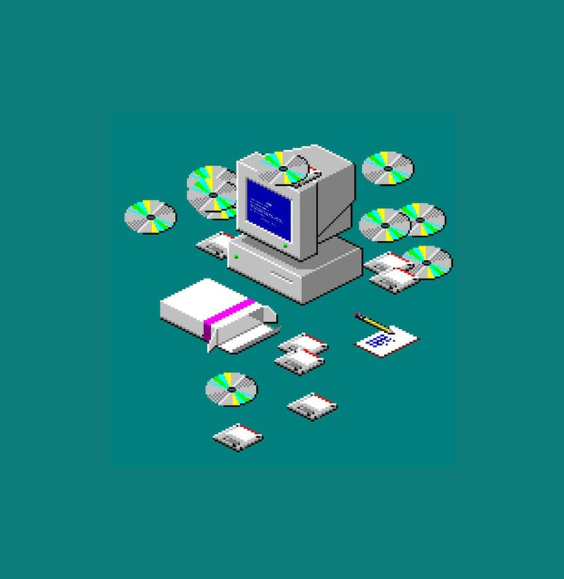
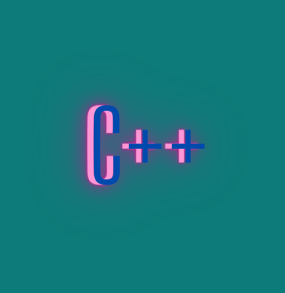
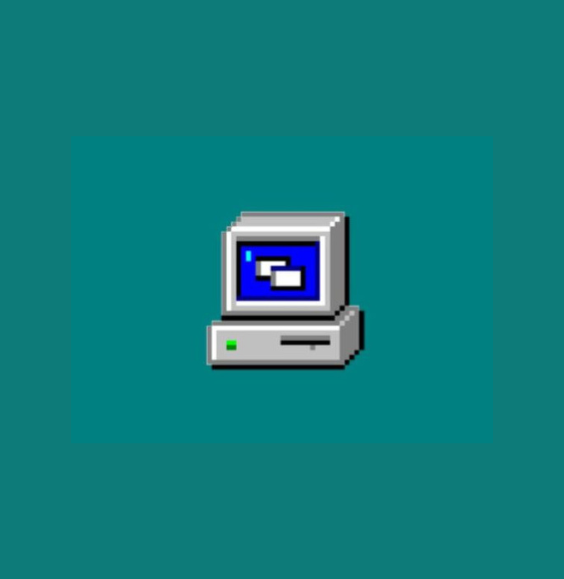

# UP210300_CPP

# Programming Course

 •
 •
 •

This programming course is about  _**c++**_, here you will find the main topics that will be reviewed as well as examples and exercises for each toic

[Getting started](#getting-started) •
[Find me](#find-me) •
[Clone my repo](#clone-my-repo)

## Getting started

This course is conformed of four main parts:

> 1. U1 Programming introduction
> 2. U2 Control structures and cycles
> 3. U3 Functions
> 4. U4 Files and arrays

## Find me 

>[Check me out!](https://github.com/UP210300/UP210300_CPP.git)

## Clone my repo

To clone this repo, type this command on your console.
>       git clone https://github.com/UP210300/UP210300_CPP.git

