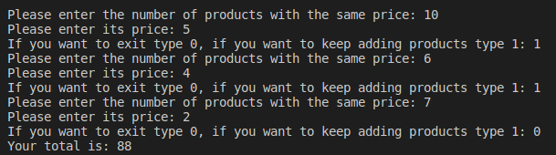

# UP210300_CPP

**UNIT 2**

Exersice 1.-Program that use compaired if to tell the user how much taxes they have to pay.

Code
 
```c++

    //Declaring variables
    float income;
    float taxToPay;
    int percentage;
    int error=0;
    
    //Ask the user for their income
    cout << "Please enter your annual rent: ";
    cin >>income;
    
    
    //Look for the tax rate acording to the income
    if ((income<10000)&&(income>0)){
        percentage=5;
    }
    else if (income>=10000 && income<20000){
        percentage=15;
    }
    else if (income>=20000 && income<35000){
        percentage=20;
    }
    else if (income>=35000 && income<60000){
        percentage=30;
    }
    else if (income>=60000){
        percentage=45;
    }
    else 
    {
        error = 1;
    }
    
    
    //Operation of how much the user have to pay acording to the tax rate and print the result
    if (error)
    {
        cout<< "Please enter a valid income"<<endl;
    }
    else
    {
        cout << "Your tax rate is: " <<percentage;  cout << "%\n";
        cout << "You have to pay: $" <<taxToPay <<endl;
    }

```

Code explanation

This program asks the user for its annual income and displays the tax rate thet corresponds and how much they have to pay, for that we implement a composite if. Firts of all we declare four variables, one for the income(income), another one for the amount they have to pay(taxToPay), one to save the percentage of the tax rate(percentage) and a last one for control error (error=1). Then we have to ask the user for its income and save it on income variable. Then we use "if" and "else if" statement to compare the income to the tax rate. Once one of the staments is true it executes the operation to know how much the user has to pay (taxToPay=income*percentage/100), if the user enters a invalid income the program will desplay an error message. Finaly it is display on to the scren the tax rate and the amount to pay.


Output

 <br>
 <br>
 <br>
 <br>
 <br>
 


Exercise 2.-Program that reads the users score and show its level of performance, as well as the amount of money thet the user will get.

Code

```c++

    //Declaring variables
    double score;
    double money;
    string rate;

    //Asking the user for its score
    cout << "Please enter your score during your evaluation: ";
    cin >> score;
 
    //Look for the score range to find out how much moner they will get and display on the screen
    if((score==0.0)) 
    {
        
        cout << "Your score this year is unacceptable \n";
        cout << "There are no benefits for you" <<endl;
    }
    else if ((score==0.4)||(score>=0.6))
    {
         money=score*2400;
        rate = (score==0.4)?"acceptable": "deserving";     
        cout << "Your score this year is: "<< rate << endl;
        cout << "The amout of money you will get is $" << money <<endl;
    }
    else
    {
        cout<< "This is not a valid score, please enter a new value" <<endl;
    }

```

Code explanation

This program uses composite is as well to find out the users score and acordind to there is a level of performance wich is rewarded with money. First we have to declare variables, one for the score(score),another one for the omount of money they are getting (money) and a satring to tell the user its rate (rete). After this we ask the user for the information and save it on the score variable. There are only three levels of performance, each one has a number so in the if statement there is the condition that the score the user has enter must correspond to one of those values and if it is true executes the operation to find out the amount of money the user will get in reward of its work, also it will display on the screen the score and the amount of money. However if the statement is false it will print an error mesage.


Output

 <br>
 <br>
 <br>
 <br>


Exercice 3.-Program that automatically calculate the price you should charge customers for entering to the game room. 

```c++

    //Declaring variables
    int age;
    int price;

    //Asking the user its age
    cout << "Please enter your age: ";
    cin >> age;

    //Look for tre age range to know how much the have to pay
    if ((age>=0)&&(age<4))
    {
        price= 0;
    }
    else if ((age>=4)&&(age<18))
    {
        price= 4;
    }
    else if (age>=18)
    {
        price= 10;
    }
    else
    {
        cout << "Error :(, please enter a valid age";
    }
    
    //Display the amount of money the user have to pay
    cout << "You have to pay $" << price; cout <<" to enter the game room" <<endl;

```

Code explanation

For this program first we set two integer variables, one to find out the age of the user (age) and a second one for tuhe price the user have to pay (price). Then we ask the user its age and save it on to the variable age. Next there is the if statement that look for the age rage that the user belong, once one of the statements is true there is an asing value for price. If any of the statements is not true it displays an error message. Finally it prints the amount of money the user has to pay to enter the room.


Output

 <br>
 <br>
 

Exercise 4.-Program that ask the user if the pizza will be vegan or not, acording to that the user can choose a complement for its pizza

```c++

    // Declaring variables
    int option;
    int complement;
    string pizzaType;
    string ingredient;

    //Asking the user to choose a pizza type
    cout << "Hi dear customer! \nPlease choose an option: \n1: Vegan \n2: Not vegan \nYour choice: ";
    cin >> option;

    //Acording to that option the user has to choose another ingredient
    if (option == 1)
    {
        cout << "Excellent choice! \nPlease choose one complement for your pizza: \n1:Bell pepper \n2:Tofu \nYour choice: ";
        cin >> complement;
        if (complement == 1)
        {
            ingredient = "bell pepper";
        }
        else if (complement == 2)
        {
            ingredient = "tofu";
        }
        else
        {
            cout << "Please enter a valid option.";
        }

        pizzaType = "vegan";
    }
    else if (option == 2)
    {
        cout << "Excellent choice! \nPlease choose one complement for your pizza: \n1:Pepperoni \n2:Jam \n3:Salmon \nYour choice: ";
        cin >> complement;
        if (complement == 1)
        {
            ingredient = "pepperoni";
        }
        else if (complement == 2)
        {
            ingredient = "jam";
        }
        else if (complement == 3)
        {
            ingredient = "salmon";
        }

        else
        {
            cout << "Please enter a valid option.";
        }

        pizzaType = "not vegan";
    }
    else
    {
        cout << "Sorry! This is not a valid option, plese try again";
    }
 
    //Display on the screen the users order acording to what they chose
    cout << "Your order is: " << pizzaType;
    cout << " pizza with tomato sauce, mozzarella and " << ingredient;
    cout << endl;

```

Code explanation

On this program the user has to choose between vegan or not vegan pizza. We have to set four variables, two integer type, one for the two pizza options (option) and another one for the complements (complement). The other variables are string type, there is one for thye pizza type (pizzaType) and a second one for the complement ingredient (ingredient). Then we have to ask with pizza tipe does the user wants, after that there are two main if statements one for each type of pizza, on each statement there is an asing value for the variable pizzaType for the two different options. There is another if clause to ask the user wich complement wants, then we have another if statement to asing  a value for the ingredient variable. If any of the other statements is false it is diaplay an error message. Fianlly it is display on to the screen the order of the user wich contains the type of pizza and the choosen complement.

Output

 <br>
 <br>
 <br>
 <br>
 

Exercise 5.-Program that allows the user to enter 6 temperatures, determine the avertage, highest and lowest temperature

Code

Output

Exercise 6.-Program that ask the user for the product and its price then prints a receipt

Code

```c++
    //Declaring variables
    int product;
    int cont;
    float price;
    float total=0;

    //Do while cycle to find out the number of product and its price
    do
    {
        cout << "Please enter the number of products with the same price: ";
        cin >> product;
        cout << "Please enter its price: ";
        cin >> price;
        cout << "If you want to exit type 0, if you want to keep adding products type 1: ";
        cin >> cont;
        total= total+ (product*price);

    } while (cont != 0);

    //Display the receipt 
    cout << "Your total is: " <<total <<endl;

```

Code explanation

This code is for a program that ask the user for the product and its price then prints a receipt. We declare 4 variables, two integers for the number of products(products) and the counter to keep going the cycle (cont). Then two float variables, one for the price of the product (price) and a last one for the total price (total). We also have do while cycle where the condition is that when cont is different than 0 the cycle will continue. Inside the cycle we have to ask the user the amount of products with the same price and its price, also ask if the user wants to keep adding products, if the user types 1 then the cycle continues until the user types 0, when the cycle end it is display on to the screen the total.

Output

 <br>
 

    

    
