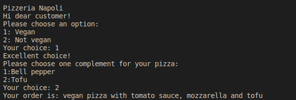
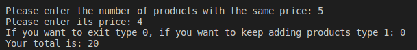
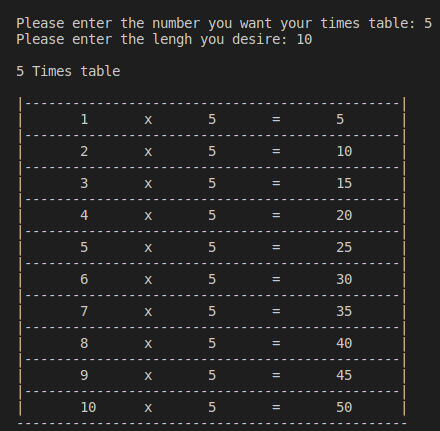

# UP210300_CPP

<div align="center">

# **UNIT 2: Control structures and cycles**

This unit is all about control structures and building blocks of computer programs that enable a program to “take decisions” and follow one path or another. 
 
</div>
 
>The basic Control Structures in programming languages are:<br>
>Conditionals (such as if): which are used to execute one or more statements if a condition is met.<br>
>Cycle (including for, do-while and while): which purpose is to repeat a statement a certain number of times or while a condition is fulfilled.

<div align="center">
 
Check out the following exercises taht shows the use of each control structure.
 
[Rent](https://github.com/UP210300/UP210300_CPP/tree/main/U2#rent)•
[Benefits](https://github.com/UP210300/UP210300_CPP/tree/main/U2#benefits)•
[Games room](#games-room)•
[Pizza shop](#pizza-shop)•
[Temperatures](#temperatures)•
[Receipt](#receipt)•
[Conversions](#conversions)•
[Times tables](#times-tables)•
[Bisection method](#bisection-method)

</div>

## *Rent* <br> 
## Exercise 1

Program that use compaired if to tell the user how much taxes they have to pay.

### Code
 
```c++

    //Declaring variables
    float income;
    float taxToPay;
    int percentage;
    int error=0;
    
    //Ask the user for their income
    cout << "Please enter your annual rent: ";
    cin >>income;
    
    
    //Look for the tax rate acording to the income
    if ((income<10000)&&(income>0)){
        percentage=5;
    }
    else if (income>=10000 && income<20000){
        percentage=15;
    }
    else if (income>=20000 && income<35000){
        percentage=20;
    }
    else if (income>=35000 && income<60000){
        percentage=30;
    }
    else if (income>=60000){
        percentage=45;
    }
    else 
    {
        error = 1;
    }
    
    
    //Operation of how much the user have to pay acording to the tax rate and print the result
    if (error)
    {
        cout<< "Please enter a valid income"<<endl;
    }
    else
    {
        cout << "Your tax rate is: " <<percentage;  cout << "%\n";
        cout << "You have to pay: $" <<taxToPay <<endl;
    }

```

### Code explanation

<div align="justify">
This program asks the user for its annual income and displays the tax rate thet corresponds and how much they have to pay, for that we implement a composite if. Firts of all we declare four variables, one for the income(income), another one for the amount they have to pay(taxToPay), one to save the percentage of the tax rate(percentage) and a last one for control error (error=1). Then we have to ask the user for its income and save it on income variable. Then we use "if" and "else if" statement to compare the income to the tax rate. Once one of the staments is true it executes the operation to know how much the user has to pay (taxToPay=income*percentage/100), if the user enters a invalid income the program will desplay an error message. Finaly it is display on to the scren the tax rate and the amount to pay.
</div>

### Output

 <br>
 <br>
 <br>
 <br>
 <br>
 

### Find the .cpp file

>[01_Renta.cpp](https://github.com/UP210300/UP210300_CPP/blob/main/U2/01_Rent.cpp)

## *Benefits* <br>
## Exercise 2

Program that reads the users score and show its level of performance, as well as the amount of money thet the user will get.

### Code

```c++

    //Declaring variables
    double score;
    double money;
    string rate;

    //Asking the user for its score
    cout << "Please enter your score during your evaluation: ";
    cin >> score;
 
    //Look for the score range to find out how much moner they will get and display on the screen
    if((score==0.0)) 
    {
        
        cout << "Your score this year is unacceptable \n";
        cout << "There are no benefits for you" <<endl;
    }
    else if ((score==0.4)||(score>=0.6))
    {
         money=score*2400;
        rate = (score==0.4)?"acceptable": "deserving";     
        cout << "Your score this year is: "<< rate << endl;
        cout << "The amout of money you will get is $" << money <<endl;
    }
    else
    {
        cout<< "This is not a valid score, please enter a new value" <<endl;
    }

```

### Code explanation

<div align="justify">
This program uses composite is as well to find out the users score and acordind to there is a level of performance wich is rewarded with money. First we have to declare variables, one for the score(score),another one for the omount of money they are getting (money) and a satring to tell the user its rate (rete). After this we ask the user for the information and save it on the score variable. There are only three levels of performance, each one has a number so in the if statement there is the condition that the score the user has enter must correspond to one of those values and if it is true executes the operation to find out the amount of money the user will get in reward of its work, also it will display on the screen the score and the amount of money. However if the statement is false it will print an error mesage.
</div>

### Output

 <br>
 <br>
 <br>
 <br>

### Find the .cpp file

>[02_Benefits.cpp](https://github.com/UP210300/UP210300_CPP/blob/main/U2/02_Benefits.cpp)

## *Games room* <br>
## Eercice 3

Program that automatically calculate the price you should charge customers for entering to the game room. 

### Code

```c++

    //Declaring variables
    int age;
    int price;

    //Asking the user its age
    cout << "Please enter your age: ";
    cin >> age;

    //Look for tre age range to know how much the have to pay
    if ((age>=0)&&(age<4))
    {
        price= 0;
    }
    else if ((age>=4)&&(age<18))
    {
        price= 4;
    }
    else if (age>=18)
    {
        price= 10;
    }
    else
    {
        cout << "Error :(, please enter a valid age";
    }
    
    //Display the amount of money the user have to pay
    cout << "You have to pay $" << price; cout <<" to enter the game room" <<endl;

```

### Code explanation

<div align="justify">
For this program first we set two integer variables, one to find out the age of the user (age) and a second one for tuhe price the user have to pay (price). Then we ask the user its age and save it on to the variable age. Next there is the if statement that look for the age rage that the user belong, once one of the statements is true there is an asing value for price. If any of the statements is not true it displays an error message. Finally it prints the amount of money the user has to pay to enter the room.
</div>

### Output

 <br>
 <br>
 

### Find the .cpp file

>[03_GamesRoom.cpp](https://github.com/UP210300/UP210300_CPP/blob/main/U2/03_GamesRoom.cpp)

## *Pizza shop* <br>
## Exercise 4

Program that ask the user if the pizza will be vegan or not, acording to that the user can choose a complement for its pizza

### Code

```c++

    // Declaring variables
    int option;
    int complement;
    string pizzaType;
    string ingredient;

    //Asking the user to choose a pizza type
    cout << "Hi dear customer! \nPlease choose an option: \n1: Vegan \n2: Not vegan \nYour choice: ";
    cin >> option;

    //Acording to that option the user has to choose another ingredient
    if (option == 1)
    {
        cout << "Excellent choice! \nPlease choose one complement for your pizza: \n1:Bell pepper \n2:Tofu \nYour choice: ";
        cin >> complement;
        if (complement == 1)
        {
            ingredient = "bell pepper";
        }
        else if (complement == 2)
        {
            ingredient = "tofu";
        }
        else
        {
            cout << "Please enter a valid option.";
        }

        pizzaType = "vegan";
    }
    else if (option == 2)
    {
        cout << "Excellent choice! \nPlease choose one complement for your pizza: \n1:Pepperoni \n2:Jam \n3:Salmon \nYour choice: ";
        cin >> complement;
        if (complement == 1)
        {
            ingredient = "pepperoni";
        }
        else if (complement == 2)
        {
            ingredient = "jam";
        }
        else if (complement == 3)
        {
            ingredient = "salmon";
        }

        else
        {
            cout << "Please enter a valid option.";
        }

        pizzaType = "not vegan";
    }
    else
    {
        cout << "Sorry! This is not a valid option, plese try again";
    }
 
    //Display on the screen the users order acording to what they chose
    cout << "Your order is: " << pizzaType;
    cout << " pizza with tomato sauce, mozzarella and " << ingredient;
    cout << endl;

```

### Code explanation

<div align="justify">
On this program the user has to choose between vegan or not vegan pizza. We have to set four variables, two integer type, one for the two pizza options (option) and another one for the complements (complement). The other variables are string type, there is one for thye pizza type (pizzaType) and a second one for the complement ingredient (ingredient). Then we have to ask with pizza tipe does the user wants, after that there are two main if statements one for each type of pizza, on each statement there is an asing value for the variable pizzaType for the two different options. There is another if clause to ask the user wich complement wants, then we have another if statement to asing  a value for the ingredient variable. If any of the other statements is false it is diaplay an error message. Fianlly it is display on to the screen the order of the user wich contains the type of pizza and the choosen complement.
</div>

### Output

 <br>
 <br>
 <br>
 <br>
 

### Find the .cpp file

>[04_PizzaShop.cpp](https://github.com/UP210300/UP210300_CPP/blob/main/U2/04_PizzaShop.cpp)

## *Temperatures* <br>
## Exercise 5

Program that allows the user to enter 6 temperatures, determine the average, highest and lowest temperature

### Code

```c++

    //Declaring variables
    int counter=1;
    float temperature;
    float acumTemperature=0;
    float max=-274;
    float min=274;

    //Loop to repeat the process 6 times
    do
    {
        //Ask the user for the temperatures
        cout << "Please type temperature " <<counter << ": ";
        cin >> temperature;
        //Acccumulator to add up every temperature
        acumTemperature = acumTemperature + temperature;
        counter ++;
        //Compare every temperature to find out the highest and lowest temperature
        if (temperature <= min)
        {
            min= temperature;
        }
        if (temperature >= max)
        {
            max= temperature;
        }
            

    } while (counter <= 6);

    //Display the results
    cout << "The average temperature is " << acumTemperature/6 << ", the higher one is " << max <<" and the minimum is " << min << endl;

```

### Code explanation 

<div align="justify">                                                                                                                                       
This program llows the user to enter 6 temperatures, determine the average, highest and lowest temperature, first we need five variables. An integer for the counter (counter), the other one are floating type, we need one for the temperatures (temperature), one for the accumulator (acumTemperature), lastly two to save and compare highest and lowest temperature (max=-274, min=274) *NOTE: We set this variables with this values acording to the plank temperature and absolut zero*. Then we have a do while loop with the condition (counter <= 6), while that is true we ask the user for the temperature and save on temperature, then add it on the accumulator acumTemperature, the with the two if statments compare it two find out if it is the lowest or highest temperatures. Once this loop end it is dsiplay the average temperature (divide between 6 the value of the variable acumTemperature), the highest and lowest temperature.
</div>

### Output

 

### Find the .cpp file
 
>[0.5_Temperatures.cpp](https://github.com/UP210300/UP210300_CPP/blob/main/U2/05_Temperatures.cpp)

## *Receipt* <br>
## Exercise 6

Program that ask the user for the product and its price then prints a receipt

### Code

```c++

    //Declaring variables
    int product;
    int cont;
    float price;
    float total=0;

    //Do while cycle to find out the number of product and its price
    do
    {
        cout << "Please enter the number of products with the same price: ";
        cin >> product;
        cout << "Please enter its price: ";
        cin >> price;
        cout << "If you want to exit type 0, if you want to keep adding products type 1: ";
        cin >> cont;
        total= total+ (product*price);

    } while (cont != 0);

    //Display the receipt 
    cout << "Your total is: " <<total <<endl;

```

### Code explanation

<div align="justify">
This code is for a program that ask the user for the product and its price then prints a receipt. We declare 4 variables, two integers for the number of products(products) and the counter to keep going the cycle (cont). Then two float variables, one for the price of the product (price) and a last one for the total price (total). We also have do while cycle where the condition is that when cont is different than 0 the cycle will continue. Inside the cycle we have to ask the user the amount of products with the same price and its price, also ask if the user wants to keep adding products, if the user types 1 then the cycle continues until the user types 0, when the cycle end it is display on to the screen the total.
</div>

### Output

 <br>
 

Find the .cpp file

>[0.6_Receipt.cpp](https://github.com/UP210300/UP210300_CPP/blob/main/U2/06_Receipt.cpp)

## *Conversions* <br>
## Exercise 7

Program that converts a decimal number to a binary number

### Code
```c++

  //Declaring variables
  int decimal;
  string binary;

  //Ask the user for a number to convert
  cout << "Decimal to binary conversion \n\n";
  cout << "Decimal number: ";
  cin >> decimal;

  //Find out if the number enter by the user is above 0
  if (decimal > 0)
  {
    //Loop to do the conversion
    while (decimal != 0)
    {
      if (decimal % 2 == 0)
      {
        binary = "0" + binary;
      }
      else
      {
        binary = "1" + binary;
      }
      decimal= decimal/2;
    }
    //Display the result
     cout << "Binary number: " << binary << endl;
  }
  else
  {
    cout << "Please enter a number above 0" <<endl;
  }

```
### Code explanation

<div align="justify">
This code is for a program that that converts a decimal number to a binary number. To do this we need two variables, a integer for the decimal number (decimal) and a string type for the decimal number (binary). Then we must ask the user to enter a decimal number above 0, if the user does it incorrectly it is display a error message. If the statement is true then we have a while loop to divide the number between two to find out the binary number. Finally when the loop ends it is display the result.
</div>

### Output

 <br>
 

### Find the .cpp file
 
>[0.7_Conversions.cpp](https://github.com/UP210300/UP210300_CPP/blob/main/U2/07_Conversions.cpp)

## *Times tables* <br>
## Exercise 8

Program that ask the user for a number and gives it the times table of the lenght the user desires

### Code

```c++

    //Declaring variables
    int number;
    int lenght;

    //Ask the user fot the lenght and number of times table
    cout << "Please enter the number you want your times table: ";
    cin >> number;
    cout << "Please enter the lengh you desire: ";
    cin >> lenght;
    cout <<"\n" << number << " Times table \n\n";
    
    //Operations between lenght and number to create times table 
    for ( int i = 1; i <= lenght; i++)
    {
        cout << "|";//Diaplay to create the side line of the table
        for (int j= 1; j <48; j++)//Display to create the separation between each result
        {
            cout << "-";
        }
        cout << "|";//Diaplay to create the side line of the table
        cout << "\n";
        cout << "|\t" << i << "\t" << "x"  << "\t" << number << "\t" << "=" << "\t" << i*number << "\t|\n"; //Disĺay the result of the operations
        
    }
    for (int j= 1; j <50; j++)//Display the bottom line of the table
    {
        cout << "-";
    }
    cout << endl;

```
### Code explanation

<div align="justify">
This program ask the user for a number and gives it the times table of the lenght the user desires. We will need two integer variables one for the number of the times table (number) and another one for the lenght(lenght). Then we ask the userfor each number and save the on to the variables. Then there is a for cycle, the fist one fot the columns of the times table that will be as long ad the value of lenght, also there is the "|" character to display the side line of the tanle. Then we have one more for loop but this one is to crete the separation between each result, after this loop we display one again the character "|" to create the other side line. Finally we have the line that does the operation and siplay every result. The las for loop is to print the bottom line of the times table.
</div>

### Output

 
    
### Find the .cpp file

>[0.8_TimesTables](https://github.com/UP210300/UP210300_CPP/blob/main/U2/08_TimesTables.cpp)

## *Bisection method* <br>
## Exercise 9

Program that uses the Bisection method

### Code

```c++

//Function that solves the ecuation
float solveEquation(float worth) {
        return pow(worth,2) - worth- 12;
    }

//Main function integer type
int main (){

    //Declaring variables
    float a;
    float b;
    float c;
    float ya;
    float yb;
    float yc;
    float error = 0.01;
    int i;

    cout << "Root fot the function x²+x-12 \n\n";

    //Ask the user to enter the value of the variables
    cout << "Enter a value of (a): ";
    cin >>  a;
    cout << endl;
    cout << "Enter a value of (b): ";
    cin >>  b;
    cout << "\n";

    //Look if the ecuation has a root
    c = (a+b)/2;
    ya = solveEquation(a);
    yb = solveEquation(b);
    yc = solveEquation(c);
    
    if ((yb * ya < 0) || (ya * yc < 0) || (yc * yb < 0)){
        //Print table header
        for (i = 1, i = 0; i < 121; i++)
    {      
    cout << "_";
    }
    cout << "\n";
    
    cout     << "|" 
             << "\t" << "a" << "\t"
             << "\t" << "b" << "\t"
             << "\t" << "c" << "\t"
             << "\t" << "ya" << "\t" << "\t"
             << "\t" << "yb" << "\t"
             << "\t" << "\t" << "yc" << "\t" << "\t" 
             << "|" << endl;
             cout << "|";
        for (i = 1, i = 0; i < 119; i++)
        {
            cout << "_";
        }
        cout << "|";
    //Loop to keep solving the ecuation
    do
    {
            c = (a+b)/2;
            ya = solveEquation(a);
            yb = solveEquation(b);
            yc = solveEquation(c);
        if (ya*yc<0)
        {
            b = c;
        }
        else if (yc*yb<0)
        {
            a = c;
        }

    cout << "\n";
    cout << fixed;
     //Print table with the results of the ecuation solved
    cout << setprecision(3)<< "|" 
             << "\t" << a << "\t"
             << "\t" << b << "\t"
             << "\t" << c << "\t"
             << "\t" << ya << "\t" << "\t"
             << "\t" << yb << "\t"
             << "\t" << "\t" << yc << "\t" << "\t" 
             << "|" << endl;
             cout << "|";
            
    for (i = 1, i = 0; i < 119; i++)
            {
                cout << "_";
            }
            cout << "|";
    } while (abs(yc)>= error);

    }
    else {
        
        cout << "The root does not exist" <<endl;

    }
    //As a function it must return to a value, in this case 0
    return 0;   

```
### Code explanation

<div align="justify">
This program uses the bisection method, this is an approximation method to find the roots of the given equation by repeatedly dividing the interval. To do this we need a function outside the main function ( solveEquation(float worth) ) this is a float type of function and its value returns to the worth variable that is is also a float type. Then we have the main function in to wich we fist have to declare several variables to store the value of a (a),b(b),c(c), the value of y (ya,yb,yc),an error control variable(error), and a variable to start the for cycle (i). Fist we ask the user for the value of a and b, then the solveEcuation funciond and the operation asigned to c is executed. Then the formula is applied  and If the the statement (yb * ya < 0) || (ya * yc < 0) || (yc * yb < 0)) is true then means the signs are opposites so there is a root in between, then cuts the distance in between the locations in half, check both extremes to see if the signs are opposites again. This process is repeated until the formula reaches an approximation to 0-+0.01, finally prints out the table listing all the process behind calculating the root. However if the statement is not true means the signs are the same, there is no root between them and displays an error message. 
</div>

### Output

 <br>
 

### Find the .cpp file

>[0.9_BisectionMethod](https://github.com/UP210300/UP210300_CPP/blob/main/U2/09_BisectionMethod.cpp)
