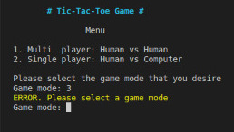
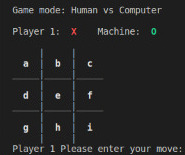

# UP210300_CPP

# **TIC-TAC-TOE**

This game is for two players who take turns marking the spaces in a three-by-three grid with X or O. The player who succeeds in placing three of their marks in a horizontal, vertical, or diagonal row is the winner. It is a solved game, with a forced draw assuming best play from both players. 
 

 

 
Check out the following program that allows you to play the game with another peer (multi player) or the machine (single player).
 

[Instructions](#instructions) •
[Considerations](#considerations) •
[Flowchart](#flowchart)•
[Code explanation](#code-explanation) •
[Conclusion](#conclusion) 

## Instructions

For windows:

1. Make shure that you have a compiler. If you do not have one [click here](https://code.visualstudio.com/docs/cpp/config-mingw) for the step by step instructions to install it. [Here](https://www.msys2.org) is the compiler page.

2. Install a source editor like [Visual Studio](https://code.visualstudio.com/)

3. Download the code, load it into the source editor and compile it.

4. All set up! Now you can run this game

For linux:

1. Clone my repo

To clone this repo, type this command on your console or terminal.

>       git clone https://github.com/UP210300/UP210300_CPP.git

2. Install GNU c/c++ compiler

Open the terminal and type the following commands.

>       $ sudo apt-get update
>       $ sudo apt-get install build-essential manpages-dev

3. Compile this program

To compile this program type this command.

>       gcc  Tic-Tac-Toe.cpp -o Tic-Tac-Toe.exe

4. All set up! Now you can run this game

To run this program, type this command.
   
>./Tic-Tac-Toe

## Considerations

While selecting the game mode that you desire, please type what you are aks for (1 or 2), otherwise you you will get an error message.

  

Once you select a mode, the game mode will be desplayed as well as the mark correspondig to each player. In sigle mode the machine is 'O' or player 2.

  
  

Inside the each box of the grid there is a letter correspondig to a possible move, when selecting a move please only type the letters fron 'a' to 'i' otherwise you you will get an error message.

  

Once the game ends you can keep playing by typing 'y', or you can exit the game typing 'n'. If you type 'y' you will go back to the menu and if you type 'n' you will get the netx output.

  

## Flowchart

  
 

## Code explanation

As it was mentiones before, this game has two modes, single and multi player. First it is displayed a menu that shows you the options such as:

Tic-Tac-Toe Game 

Menu    

1. Multi  player: Human vs Human
2. Single player: Human vs Computer 

You must type the option that you desire.

Single player: Human vs Human

In single player mode player 1 is 'X' and player 2 is 'O'.
Once you chose this mode it is display the game mode, the mark for each player and then the grid with every possible move. You must choose the move that you desire, one again if you choosea a diffrenrent move from the ones display on the screen you will get an error message until you choose a valid option.

After you choose your move, the program checks if that move is possible (if it the program stablish that the selected move is unavailable it displays an error message until you choose a valid option), then place the move in to the gread, clears the screen and diplays the game mode, the mark for each player and the new grid with thee mark of the move of the first player. Finally checks if there is a winner and changes the turn.

Turns change until there is a winner or there are no more possible moves. Then it displays the winner, restarts the turn and ask the user if they whant to keep playing.

 

 

 

If the user wants to keep playing they must type 'y' and if they desire to exit the game they must type 'n'

Multi player: Human vs Computer

In multi player the user or human is 'X' and the machine or computer is 'O'.
Unfortunetly this code does not have IA (it is still under construction, hopefully it will be available soon). That being said this game mode works pretty much the same as single player. When the turn is uneven it means that it is the computer's turn and the way it chooses and option is with a random command.

 

 

 

## Conclusion

Coding this game has been the biggest challenge yet. The game Tic-Tac-Toe might seem as a very easy game, but once you think about it and look at all the logic behind it it does not seem that easy. This is the reason I faced several challeges.

While doing this program I found many obstacles, the main one being the use of functions. This was my main problem because I did not understand very well how to use the functions and then how to call them on the main function. However I could overcome this obstacle succesfully. Another obstacle was trying to develop the AI, I try to make the machine "smart" to make a more acurrate game when playing in single player mode, unfortunetly I could not make it right, meanwhile I had to use a random command for the machine to be able to "choose" a move. I do intend to keep working on the code to make it better and develop the IA.

A side from the obstacles mention before, I do belive that the code that I have created was able to meet the expectations and overall it dooes what it suppoused to runs pretty smooth. Finally, working on this code taught me a lot of new things that for sure will be helpful in the future. I was able to develop even more my logic and also learned how to use functions and arrays. 

